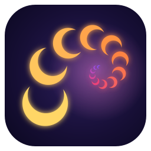
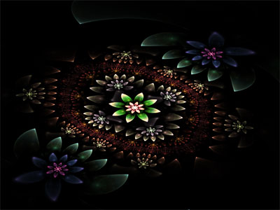

<p align="center">
  
</p>

<h1 align="center">Calyptra</h1>

<p align="center">
  A Windows desktop app for exploring and rendering <b>3D fractals</b> and <b>flame fractals</b>
  as high-quality stills and movies. Written in Rust on wgpu and egui.
</p>

<p align="center">
  
  
</p>

## Features

- **3D distance-estimated fractals.** Mandelbulb, Mandelbox, IFS and hybrids, built by chaining formula steps.
- **Two renderers.** A fast interactive raymarched preview with AO, soft shadows, fog and glow, plus a progressive path tracer with depth of field for final renders.
- **Flame fractals.** 2D and 3D flames with 3×4 affines, 3D variations, density estimation and a 3D camera with depth of field.
- **`.flame` import/export** that works with Apophysis, including the Apophysis 3D hack format.
- **Color tools.** An OKLab gradient editor, a palette library, and orbit-trap and iteration-based coloring. Images are rendered in HDR and tone mapped.
- **Random, Mutate, Batch Random and History** for finding new shapes. Random fractals are tested and retried until one renders well.
- **Keyframe animation** on a timeline, with movies rendered through ffmpeg.
- **Export** of tiled high-resolution stills as 16-bit PNG or EXR, and of frame sequences.
- **Custom formulas** written in WGSL. They use the same pipeline as the built-in ones.
- **Command-line rendering** for batch jobs.

Calyptra is designed to run well on integrated graphics such as Intel Iris Xe. It does not need CUDA or fast FP64.

## Requirements

- Windows 10 or 11 with a Direct3D 12 or Vulkan capable GPU
- A stable Rust toolchain ([rustup](https://rustup.rs)). The workspace uses edition 2024.
- *Optional:* **ffmpeg**, needed only to render movies:
  ```bash
  winget install ffmpeg
  ```

## Getting started

```bash
git clone https://github.com/wierdling/Calyptra.git
cd Calyptra
cargo run --release -p calyptra
```

Always build with `--release` for real work, because debug builds are much slower.

On first launch you'll see a Mandelbulb:

1. **Left-drag** to orbit and **scroll** to zoom.
2. Click **🎲 Random** in the *Fractal* section to get a new fractal.
3. Choose a palette from **Load palette…** in the *Color* section.
4. Use **File → Export image…** to save a high-resolution picture.

Your scene and animation are saved when you close the app. **File → Reset everything** returns to the defaults.

## Command-line rendering

Still image (`.png` or `.exr`). The arguments are width, height and samples. `--scene` accepts a scene `.json`, an exported `.png`, or a `.flame` file:

```bash
cargo run --release -p export --example export_still -- out.png 3840 2160 16 --scene my_scene.json
```

Movie (the scene must contain keyframes):

```bash
cargo run --release -p export --example export_movie -- out.mp4 1920 1080 16 --project my_scene.json
```

The [user manual](docs/USER_MANUAL.md#11-command-line-rendering) lists all the flags.

## Documentation

- [User manual](docs/USER_MANUAL.md) ([PDF](docs/USER_MANUAL.pdf), [HTML](docs/user-manual.html)) covers navigation, fractals, flames, color, animation, export and troubleshooting.
- [Custom formulas](docs/custom-formulas.md) explains how to write your own WGSL formula steps.
- [PLAN.md](PLAN.md) describes the architecture, design decisions and roadmap.

## Project layout

| Crate | Purpose |
|---|---|
| `app/` | The `calyptra` binary: egui/wgpu window, viewport, panels, timeline and render queue |
| `scene/` | Serializable scene model, parameters, camera |
| `anim/` | Keyframes and interpolation |
| `formulas/` | Formula registry, WGSL snippet library and shader composer |
| `render/` | Raymarch preview, path tracer and flame renderer |
| `color/` | OKLab gradients, palette library and palette import |
| `export/` | Tiled hi-res stills, PNG16/EXR, frame sequences and ffmpeg piping |

## Contributing

Contributions are welcome. Please open an issue or pull request on [GitHub](https://github.com/wierdling/Calyptra).
